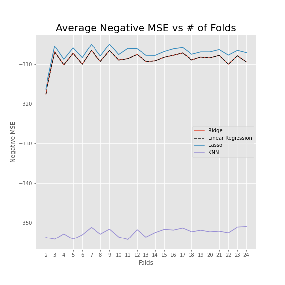
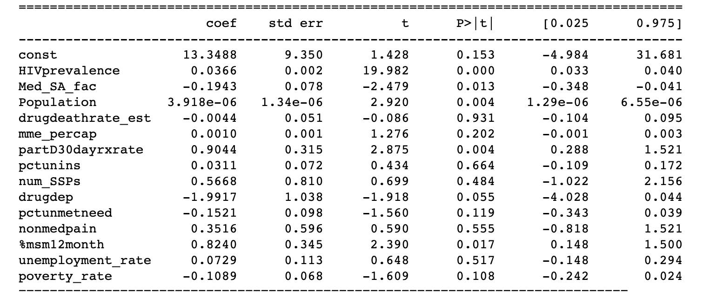

# Predicting HIV Incidence
## Isabella Sun, Robbie Gamboa, Katie Johnson

## Introduction
Using data merged from several sources, we build a model that predicts HIV incidence for US counties. As of 2015 there were 971,524 people living with diagnosed HIV in the US. We look at risk factors associated with HIV infection including socioeconomic factors like poverty and unemployment as well as factors contributing to the opiod crisis, which has made combating HIV infection outbreaks more complicated. 

# Data
The information in our dataset is at the county level and only for the year 2015. These data included in the analysis come from 3 source:

1. American Foundation for AIDS Research (amfAR)
    - HIV incidence
    - HIV prevalence
    - Medical facilities
    - Population
    - Drug deaths
    - Population
2. US Census Bureau
    - Unemployment
    - Poverty
3. Emory Coalition for Applied Modeling for Prevention (CAMP)
    - MSM (men who have sex with men)

# Analysis

To choose our best model, we first began by comparing various regression models, specifically linear regression, lasso, ridge, and K nearest neighboors.

We split our data into a training set and test set. Using a k fold cross validation method, we determined the average mean squared errors of our training set under each of the models. The average mean squared erros between the linear regression, lasso, and ridge models were unsurprisingly very close. 

From this point forward, we chose to explore the ridge and lasso models and test various alpha/lambda values to determine the best fit. We used a `GridSearchCV` function with the `.best_estimator_` attribute from `SkLearn` to find the best alpha. 

We found that the best alpha was 2.5 for the Lasso method. 
For the Ridge method, we found that the highest alpha was chosen by the best_estmator attribute. 

Once we ran the model on our untested data, we determined that there was no significant difference between using a Lasso or Ridge method by the mean squared error method. 

| Model | Mean Squared Error on unseen data|
| :-----: | :-----: |
| Lasso (alpha = 2.5) | 46.6 |
| Ridge (alpha = 200) | 48.8 |

We chose the Lasso model to determine which factors were key drivers of HIV incidence. The below table shows the betas from the Lasso model with alpha = 2.5. 

| Feature | $$\beta$$ |
| :-----: | :-----: |
| HIVprevalence  |  0.0362 |
| Med_MH_fac  |  -0.1380 |
| Population  |  3.7491e-06 |
| drugdeathrate  |  0.02079|
|drugdeathrate_est  |  -0.0169 |
| mme_percap  |  0.0010 |
| partD30dayrxrate  |  0.8800 |
| pctunins  |  0.0368 |
|num_SSPs  |  0.4319 |
| drugdep  |  -2.1571 |
| pctunmetneed  |  -0.1406 |
| nonmedpain  |  0.4662 |
| %msm12month  |  0.7808 |
| unemployment_rate  |  0.0683 |
| poverty_rate  |  -0.1048 |

The most important key drivers according to our model are:
   - **drugdep**: percent of people 12+ reporting drug dependence
   - **partD30dayrxrate**: The number of standardized 30-day supplies of opioids reimbursed by Medicare Part D, per Medicare Part D enrolle
   - **msm12month**: percent of men who have sex with men in the past 12 months
   - **nonmedpain**: Percent of Population 12 or Older Reporting Non-medical Use of Pain Relievers
   - **num_SSPs**: Total number of syringe exchange programs.

To determine whether these key drivers have a significant relationship with HIV incidence, we planned to run an inferential regression to calculate p-values and 95% confidence intervals. 

   